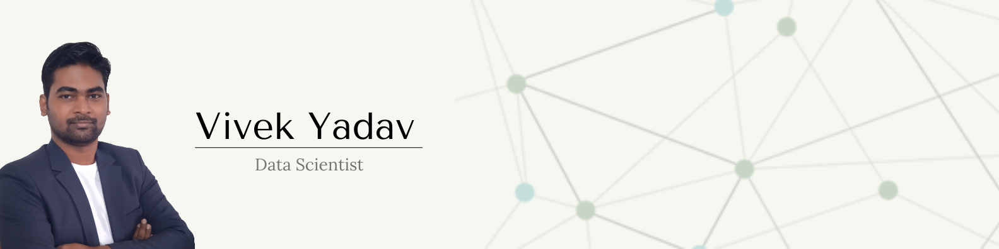

## Hi :wave: this is Vivek Yadav!
I am a Data Scientist with proven trackrecord & experience in buidling & deploying Deep Learning
solutions in production environments. 

 

## Experience

**QubitAI Technologies**
- Led Data Science team to build both open-source &
enterprise edition of Deep Learning Toolkit
- Worked closely with cloud team to build scalable ML/DL models training & inference lifecycle pipeline.
- Developed Image Segmentation based model for
building detection in aerial images
- Involved in code integration and code reviews along with client demos

 

**Capgemini**

- Developed & deployed computer vision solutions related to Face Analytics, Image Classification for multiple clients 
- Worked on multiple PoCs related to NLP & Computer Vision as part of AI-CoE

 

## Recent Projects

**Image segmentation based building detection**
- Worked on Image Segmentation based model for building detection in aerial RGB Images

- Trained U-Net, MaskRCNN models with multiple loss fuctions such as Dice, Binary Cross Entropy & Focal teversky loss

    *<u>Built using:</u> MaskRCNN, U-Net, Tensorflow, Docker*

 

**Information Extraction from Engineering Drawing Sheet**
- Developed solution to digitize titleblock information from product drawing sheets using Python, OpenCV, OCR, and Custom post OCR correction system

- This solution saved 2000+ hrs of labour in creating missing
assosciation

    *<u>Built using:</u> OpenCV, Autobahn OCR engine, MongoDB*

 

## Skills

**Model Building framework/tools**

**Model Deployment tools**

